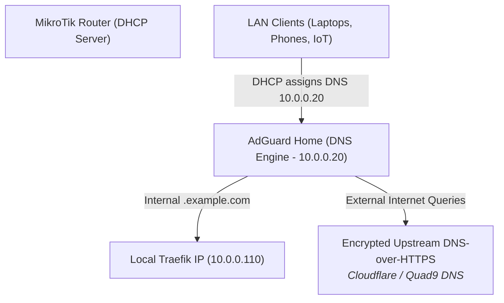

# 🛡️ AdGuard Home: Network-Wide DNS & Ad-Blocking Engine

> **Lifecycle Status**: 🟢 `[ACTIVE PRODUCTION STANDARD]`  
> **Role**: Core Network DNS Resolver & Split-Horizon Internal Routing

---

## 🛡️ DNS Architectural Evolution Log



### Key Operational Upgrades:
1. **Split-Horizon DNS**: Internal domain names (e.g. `*.example.com`) resolve directly to Traefik's internal IP (`10.0.0.110`), bypassing hairpin NAT and saving router CPU.
2. **Encrypted Upstream (DoH/DoT)**: Queries leaving the homelab use DNS-over-HTTPS (`https://dns.cloudflare.com/dns-query`), preventing ISP tracking and DNS spoofing.
3. **Docker Compose Unification**: Cleaned up duplicate configurations to provide a single, clean `docker-compose.yml`.

---

## 🚀 Production Deployment

```bash
docker compose up -d
```
Access the admin portal at `http://localhost:80` or `http://localhost:3000` on initial setup.
