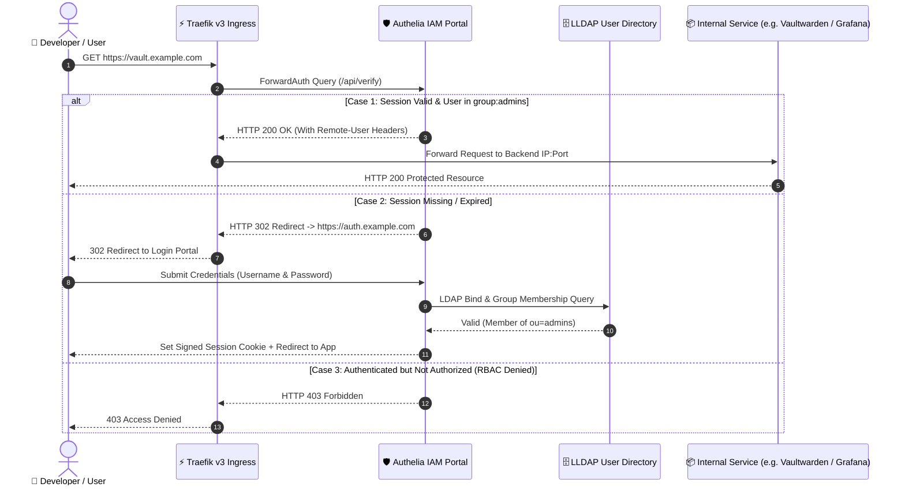

# 🔐 Zero-Trust Identity & Access Management (Authelia + LLDAP)

> **System Design Focus**: Unified Single Sign-On (SSO), ForwardAuth Ingress Verification, and Group-Based Access Delegation for Self-Hosted Applications.

---

## 💡 The Core Analogy: The Passport Checkpoint at the Border

> In insecure homelabs, every application manages its own login screen with separate passwords. If an attacker discovers a vulnerability in one app, they can brute-force it directly.
>
> **Traefik + Authelia ForwardAuth is the international border checkpoint**: No internet traffic ever touches your internal applications (Vaultwarden, Gitea, Grafana, Portals) until the traveler presents a verified cryptographic passport (session cookie) issued by Authelia. 
> 
> If the user is unauthenticated or not in the `admins` group, the edge proxy turns them away at the border. The internal application never even sees the HTTP request.

---

## 🏗️ Authentication & Authorization Flow



---

## 🧠 The 3-Layer Cognitive Model (WHAT → HOW → WHY)

### 1. WHAT: The Architecture
- **LLDAP**: A lightweight LDAP directory engine with an intuitive web UI. Replaces heavy OpenLDAP and enterprise Active Directory.
- **Authelia**: A battle-tested authentication and authorization gateway acting as the Single Source of Truth for identity.
- **Traefik ForwardAuth**: An ingress middleware that intercepts incoming HTTP requests and delegates access decisions to Authelia before routing.

---

### 2. HOW: The ForwardAuth Integration Pattern

In Traefik v3 dynamic middleware (`forwardAuth.yml`):
```yaml
http:
  middlewares:
    authelia:
      forwardAuth:
        address: "http://10.0.0.105:9091/api/verify?rd=https%3A%2F%2Fauth.example.com"
        trustForwardHeader: true
        authResponseHeaders:
          - "Remote-User"
          - "Remote-Groups"
          - "Remote-Name"
          - "Remote-Email"
```

In your application router configuration (`vault.yml`):
```yaml
http:
  routers:
    vault:
      rule: "Host(`vault.example.com`)"
      entryPoints: ["websecure"]
      middlewares:
        - "chain-defense@file"
        - "authelia@file"
      service: "vault-svc"
```

---

### 3. WHY: Delegated Group-Based Access Control (RBAC)

In `configuration.yml`, access policies are defined deterministically based on user groups:

```yaml
access_control:
  default_policy: deny
  rules:
    # 1. Health probe bypass for watchdogs & monitors
    - domain: "auth.example.com"
      resources:
        - "^/api/health$"
      policy: bypass

    # 2. Strict Admin-Only Delegation across critical infrastructure
    - domain:
        - "vault.example.com"
        - "git.example.com"
        - "logs.example.com"
        - "grafana.example.com"
      subject:
        - "group:admins"
      policy: one_factor
```

---

## 🚫 The Anti-Pattern: Dual-Gate Authentication Conflict

> **The Trap**: Placing ForwardAuth in front of mobile apps (like Bitwarden mobile client or Git CLI) that communicate over non-browser API protocols. The client expects a JSON 401 or token response, but Traefik returns an HTML 302 redirect to the login web page, breaking the mobile app.
>
> **The Solution (Dual-Layer Resolution)**:
> 1. For web portals accessed by humans: Enforce Authelia ForwardAuth.
> 2. For API / Git sync / Mobile endpoints: Use Authelia `bypass` rules for specific subpaths (e.g. `/api/health`, `/api/sync`) while protecting the root web interface with MFA/1FA.
