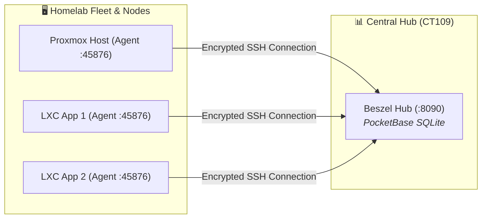

# 🦭 Beszel: Next-Gen Ultra-Lightweight Server & Container Telemetry

> **System Design Focus**: Micro-footprint hardware monitoring (<10MB RAM) for multi-node Proxmox clusters and LXC fleets without scrape overhead.

---

## 💡 The Core Analogy: The Fitness Tracker vs The Full Medical Clinic

> Running Prometheus Node Exporter + Grafana dashboards on 20 lightweight containers to check basic CPU and RAM is like hiring a team of 20 doctors to do a 10-minute checkup every morning.
>
> **Beszel is a fitness smart-band**: A single Go binary that communicates over encrypted SSH keys, records CPU, RAM, Disk, Temperature, and Docker/Podman container stats, and streams them to a pocket-sized SQLite hub using **less than 10MB of memory**.

---

## 🏗️ Architecture



---

## 🧠 The 3-Layer Cognitive Model (WHAT → HOW → WHY)

### 1. WHAT: The Architecture
- **Hub**: A single container running PocketBase + SQLite that renders a responsive web UI and manages historical retention.
- **Agent**: A tiny single-binary daemon running on each host or container, listening on port `:45876` and authenticating via an SSH ed25519 public key.

---

### 2. HOW: Agent Deployment Patterns

#### Option A: Docker / Podman Compose
```yaml
services:
  beszel-agent:
    image: henrygd/beszel-agent:latest
    container_name: beszel-agent
    restart: unless-stopped
    network_mode: host
    environment:
      - PORT=45876
      - KEY="ssh-ed25519 AAAAC3NzaC1lZDI1NTE5AAAAIExampleKey..."
    volumes:
      - /var/run/docker.sock:/var/run/docker.sock:ro
      - /sys:/sys:ro
      - /proc:/proc:ro
```

#### Option B: Native Linux Systemd Service (Recommended for LXC)
```bash
curl -sL https://raw.githubusercontent.com/henrygd/beszel/main/supplemental/scripts/install-agent.sh | sh -s -- -p 45876 -k "ssh-ed25519 AAAAC3NzaC1lZDI1NTE5..."
```

---

### 3. WHY: Why Beszel in Homelabs?

| Feature | Node Exporter + Grafana | Netdata | Beszel |
|:---|:---|:---|:---|
| **Agent Memory (RAM)** | ~25MB – 40MB | ~80MB – 150MB | **~8MB – 12MB** |
| **Configuration Complexity** | High (Scrape YAML, PromQL, Alertmanager) | Medium (Cloud login / Local web) | **Zero-Config (1 SSH Key)** |
| **Container Stats** | Requires cAdvisor (+80MB RAM) | Built-in | **Built-in Docker/Podman stats** |
| **Storage Model** | TSDB Chunk Blocks | In-memory ring buffer | **Compact SQLite Database** |
