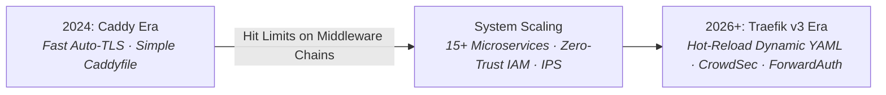

# ⚡ Caddy: Automatic HTTPS Reverse Proxy

> **Lifecycle Status**: 📦 `[HISTORICAL / ALTERNATIVE - DEPRECATED IN PRODUCTION]`  
> **Production Successor**: [`Docker/traefik/`](../traefik/) (Traefik v3 + Defense Middlewares)

---

## 📜 Architectural Evolution & Maturity Log (Why We Moved to Traefik)



### Why Caddy was Chosen in 2024:
- **Simplicity**: Caddy was the easiest zero-config proxy for automatic Let's Encrypt certificates without Certbot cron jobs.
- **Low Barrier to Entry**: Single `Caddyfile` syntax that anyone could write in 5 minutes.

### Why We Matured & Migrated to Traefik v3 in Production:
1. **Dynamic Hot-Reloading**: Adding a new service in Traefik only requires dropping a `.yml` file in `dynamic/routers/` without reloading or interrupting existing connections.
2. **Middleware Ecosystem**: Traefik provides native chaining for CrowdSec IPS bouncers, Authelia ForwardAuth, rate limits, and circuit breakers directly in YAML.
3. **Container Label Discovery**: Seamless integration with Podman and Docker socket events.

> 💡 **When to Still Use Caddy**: Caddy remains fantastic for standalone VPS, quick development staging, or simple single-app deployments where you want zero-friction Auto-TLS.

---

## 🚀 Quick Start (Historical Reference)

### 1. Configure Caddyfile
Edit `caddy/Caddyfile`:
```caddy
app.example.com {
    reverse_proxy 10.0.0.110:8080
}
```

### 2. Launch Stack
```bash
docker compose -f caddy/docker-compose.yml up -d
```
