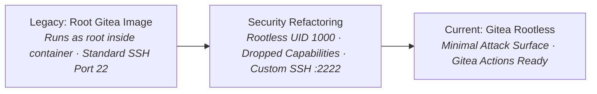

# 🔄 Gitea: Self-Hosted Lightweight Git & CI/CD Platform

> **Lifecycle Status**: 🟢 `[ACTIVE PRODUCTION STANDARD - ROOTLESS]`  
> **Security Standard**: Rootless Container Architecture

---

## 🛡️ Architectural & Security Evolution Log



### Key Upgrades Applied:
1. **Rootless Image**: Migrated to `gitea/gitea:1.22-rootless` (Process runs exclusively as user `git:git` UID 1000).
2. **Port Separation**: Web interface on `:3000`, Git SSH daemon on custom port `:2222` to avoid host SSH port collisions.
3. **No-New-Privileges**: Enforced kernel execution safety boundary.

---

## 🚀 Rootless Production Compose

```yaml
services:
  gitea:
    image: gitea/gitea:1.22-rootless
    container_name: gitea
    restart: unless-stopped
    security_opt:
      - no-new-privileges:true
    environment:
      - USER_UID=1000
      - USER_GID=1000
      - GITEA__security__INSTALL_LOCKOUT=true
    volumes:
      - ./gitea-data:/var/lib/gitea
      - ./gitea-config:/etc/gitea
    ports:
      - "3000:3000"
      - "2222:2222"
```
