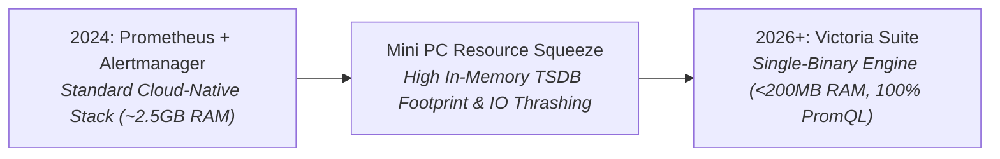

# 📊 Enterprise Monitoring Stack: Prometheus + Grafana + Alertmanager

> **Lifecycle Status**: 📦 `[HISTORICAL / ALTERNATIVE - HEAVYWEIGHT ENTERPRISE STACK]`  
> **Production Successor**: [`Docker/observability-lightweight/`](../observability-lightweight/) (VictoriaMetrics + VictoriaLogs)

---

## 📜 Architectural Evolution & Maturity Log (The 85% RAM Lesson)



### The Evolution Journey:
- **In 2024**: We deployed standard Prometheus + Alertmanager + Node Exporter. It was feature-complete and robust.
- **The Operational Gap (RCA)**: On low-power hardware (Intel N100 Mini PC, 16GB RAM), Prometheus' in-memory chunking and WAL indexing consumed **2.0GB to 3.0GB of RAM** continuously, competing with production workloads.
- **The Fix**: In 2026, we replaced Prometheus with **VictoriaMetrics** as a drop-in PromQL replacement. We retained 100% of our Grafana dashboards while reducing memory consumption by **85%**.

> 💡 **When to Still Use Prometheus + Alertmanager**: Large multi-node enterprise environments requiring Prometheus Agent federation, Thanos long-term storage clustering, or complex multi-tenant Alertmanager routing trees.

---

## 🚀 Quick Start (Enterprise Deployment)

```bash
docker compose up -d
```
Access Grafana at `http://localhost:3000` (admin/admin).
