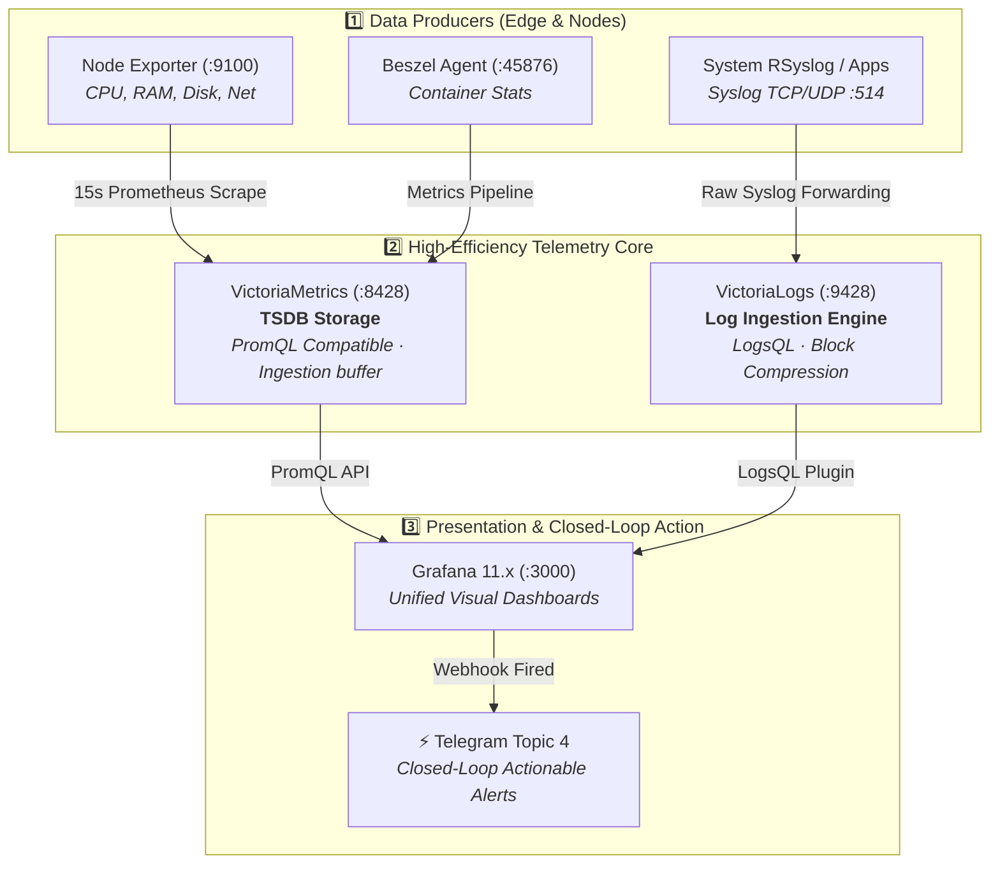
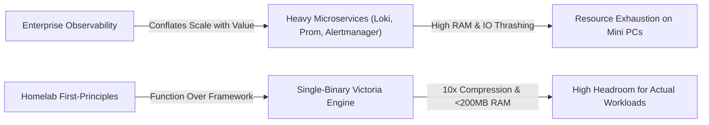

# 📊 Lightweight Observability Suite: VictoriaMetrics + VictoriaLogs + Grafana

> **System Design Focus**: High-Density, Low-Memory Telemetry Architecture for Homelabs and Resource-Constrained Edge Servers.

---

## 💡 The Core Analogy: The Jet Engine on a Bicycle

> Running enterprise observability (Prometheus TSDB + ElasticSearch/Loki + Java/JVM APM) on a single homelab Mini PC is like mounting a Boeing 747 jet engine on a bicycle. The engine consumes 4GB to 8GB of RAM just idling, generating heat and IOPS thrashing, leaving little memory for your actual applications.
>
> **The Victoria Suite is the precision electric motor**: Single self-contained Go binaries, zero JVM dependencies, and ultra-compressed block storage that sips **less than 200MB of RAM** while providing 100% PromQL compatibility.

---

## 🧠 The 3-Layer Cognitive Model (WHAT → HOW → WHY)

### 1. WHAT: The Architecture
A unified telemetry pipeline collecting both metrics (time-series) and logs (structured/unstructured events) into single-binary storage engines queried by Grafana.



---

### 2. HOW: Data Ingestion & Query Flow

1. **Metrics Scraping (Pull Model)**: `victoriametrics` embeds a built-in Prometheus scraper (`-promscrape.config`). It directly polls target endpoints (Node Exporter, Traefik, apps) every 15s without needing a separate standalone Prometheus scraper container.
2. **Log Streaming (Push Model)**: Nodes forward syslog directly to `victorialogs` over TCP/UDP port `:514`. Logs are indexed and compressed on the fly into columnar block storage without needing heavy indexers (like Elastic Logstash or Loki Promtail).
3. **Unified Querying**: Grafana connects to VictoriaMetrics as a native Prometheus datasource and to VictoriaLogs via the official plugin, displaying correlation between metric spikes and error logs on the same time axis.

---

### 3. WHY: System Design Rationale & Trade-offs



#### Why VictoriaMetrics over Prometheus Server?
- **Memory Footprint**: Prometheus uses an in-memory chunk model that easily balloons under high cardinality (1GB–3GB RAM). VictoriaMetrics uses memory-mapped disk storage with a tiny RAM buffer (~60MB–100MB).
- **Embedded Scraper**: Prometheus requires separate binaries/exporters or complex federations. VictoriaMetrics bundles the scraper directly inside the storage binary.

#### Why VictoriaLogs over Loki / ElasticSearch?
- **Zero Heavy Inverted Indexes**: ElasticSearch requires huge RAM for inverted indices. Loki requires Promtail label synchronization and can struggle with high-cardinality streams. VictoriaLogs indexes log data into compressed columnar chunks, enabling instant full-text and regex search with **up to 10x disk compression** and zero index maintenance.

---

## 🚫 The Anti-Pattern: The "Dashboard Illusion"

> **The Trap**: Many homelabbers spend days building beautiful Grafana dashboards with 50+ gauges and charts, believing their system is now "monitored". 
> 
> **The Reality (RCA)**: A dashboard is **passive**. When your proxy crashes at 3:00 AM, nobody is looking at Grafana. **Observability without verified alert delivery is just entertainment.**
>
> **The Solution**: 
> 1. Keep dashboards simple (Key 4 Golden Signals: Latency, Traffic, Errors, Saturation).
> 2. Implement **Closed-Loop Alerting**: Ensure critical saturation thresholds (>90% Disk, >95% RAM) fire immediately to your operational notification channel with actionable rescue commands.

---

## 🚀 Quick Deployment Guide

### 1. Configure Environment
```bash
cp .env.example .env
# Set your secure Grafana admin password
$EDITOR .env
```

### 2. Launch Stack
```bash
docker compose up -d
```

### 3. Configure Node Log Forwarding
Add this single line to `/etc/rsyslog.d/50-victorialogs.conf` on any Linux node or container:
```rsyslog
*.* action(type="omfwd" target="10.0.0.40" port="514" protocol="tcp"
           action.resumeRetryCount="100"
           queue.type="linkedList" queue.size="10000")
```
Then restart: `sudo systemctl restart rsyslog`.
