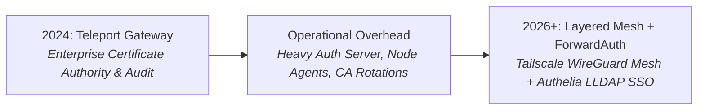

# 🔐 Teleport: Zero-Trust Infrastructure Access Gateway

> **Lifecycle Status**: 📦 `[HISTORICAL / ALTERNATIVE - ENTERPRISE ACCESS GATEWAY]`  
> **Production Successor**: [`Docker/authelia-lldap/`](../authelia-lldap/) + Tailscale Subnet Router

---

## 📜 Architectural Evolution & Maturity Log (Right-Sizing Access Security)



### The Evolution Journey:
- **In 2024**: Teleport was deployed to provide SSH session recording and unified certificate-based terminal access.
- **The Operational Gap**: For a single-operator or small-team homelab, maintaining Teleport's heavy internal CA, node enrollment tokens, and auth proxies added unnecessary cognitive and compute overhead.
- **The Modern Approach**: We shifted to a **Layered Edge Mesh Model**:
  1. **Network Layer**: Tailscale WireGuard mesh for private encrypted admin access without exposing SSH ports.
  2. **Application Layer**: Traefik + Authelia ForwardAuth for browser-based web applications.

> 💡 **When to Still Use Teleport**: Regulated multi-engineer enterprise teams requiring SOC2/ISO27001 SSH audit trails, temporary role elevation, and live session recording.

---

## 🚀 Quick Start (Enterprise Evaluation)

```bash
cd config
cp teleport.template.yaml teleport.yaml
# Configure your token and domain
docker compose up -d
```
