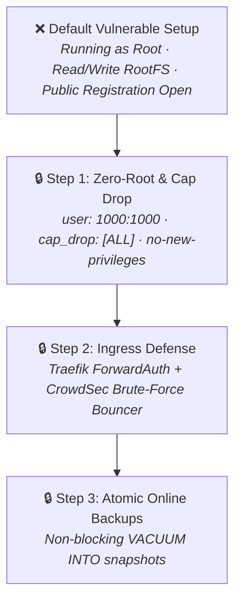

# 🔑 Vaultwarden: Lightweight Bitwarden-Compatible Secret Vault

> **Lifecycle Status**: 🟢 `[ACTIVE PRODUCTION STANDARD - HARDENED]`  
> **Security Level**: Zero-Root / Least-Privilege / Read-Only RootFS

---

## 🛡️ Security Hardening Changelog (Evolution from Default to Hardened)



### 📋 Hardening Modifications Applied:
1. **Zero-Root Execution**: Container runs under dedicated non-root UID `1000:1000`.
2. **Capability Dropping**: Added `cap_drop: [ALL]` to eliminate kernel exploitation vectors.
3. **No New Privileges**: Prevented privilege escalation via `security_opt: [no-new-privileges:true]`.
4. **Registration Control**: `SIGNUPS_ALLOWED=false` enforced by default to prevent unauthorized vault creation.
5. **Atomic Online Backup**: Integrated with `Proxmox/sqlite-maintenance/` to back up `db.sqlite3` live using WAL `VACUUM INTO`.

---

## 🚀 Hardened Production Compose

```yaml
services:
  vaultwarden:
    image: vaultwarden/server:1.32.0
    container_name: vaultwarden
    restart: unless-stopped
    user: "1000:1000"
    security_opt:
      - no-new-privileges:true
    cap_drop:
      - ALL
    environment:
      - SIGNUPS_ALLOWED=false
      - INVITATIONS_ALLOWED=true
      - WEBSOCKET_ENABLED=true
      - LOG_LEVEL=warn
    volumes:
      - ./vw-data:/data
    ports:
      - "10.0.0.117:8080:80"
```
