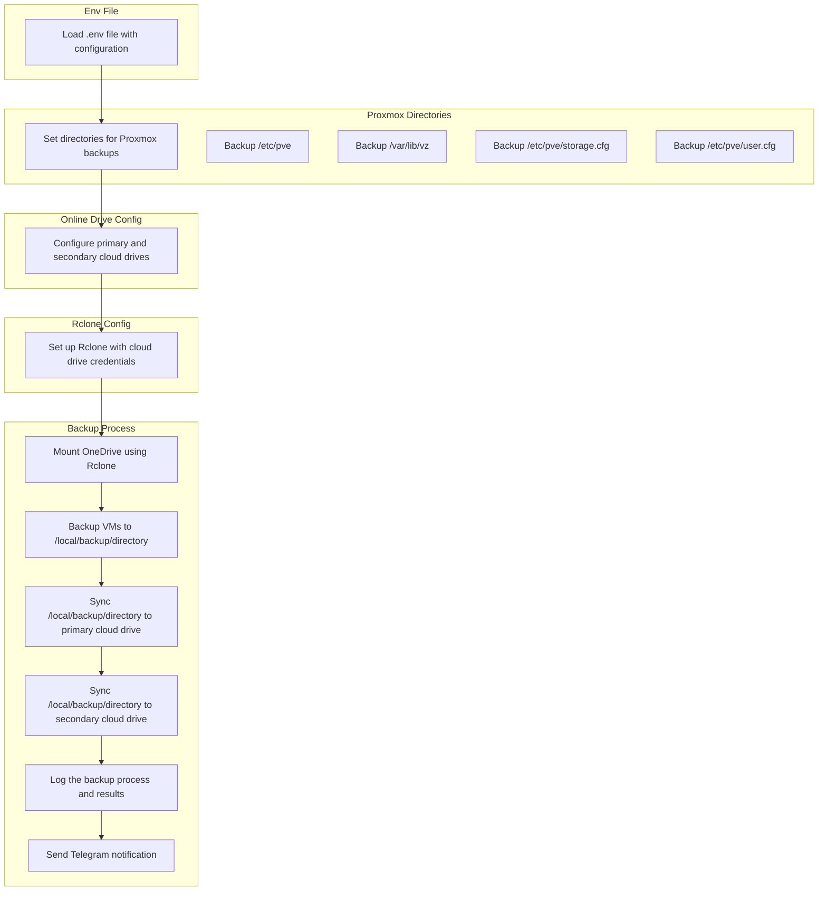

<h1 style="text-align: center; font-size: 2.5em;">Proxmox Backup Scripts</h1>

# Introduction

This guide provides a detailed workflow for backing up Proxmox virtual machines (VMs) to both local and cloud storage. The process involves loading environment configurations, setting up directories, configuring cloud drives, and using Rclone for synchronization. By following this workflow, you can ensure that your Proxmox VMs are securely backed up and synchronized across multiple storage locations.

# Workflow

# Prerequisites
Follow the instructions on the [Rclone website](https://rclone.org/install/) to install Rclone on your system.

Example for Linux:
```bash
curl https://rclone.org/install.sh | sudo bash
```

# Env file store sensitive infomation
Create a .env file in your working directory with the following content:
```bash
# =====================
# Proxmox Directories 
# =====================

# The directories related to Proxmox, including template cache, ISOs, and local backup location.
TEMPLATE_CACHE_DIR="/var/lib/vz/template/cache/"  # Directory where Proxmox stores template cache files.
ISO_DIR="/var/lib/vz/template/iso/"  # Directory where Proxmox stores ISO images.
VZ_BACKUP_DIR="/var/lib/vz/dump/"  # Directory where Proxmox stores local container backups
SNIPPETS_DIR="/var/lib/vz/snippets/" # Directory where Proxmox stores local snippets cloud-init
LOG_FILE="/var/log/proxmox_backup_$DATE.log"  # Log file for backup processes, $DATE will be replaced by the current date.

# =====================
# Online Drive Config
# =====================

# The configuration for online backup destinations, including primary and secondary drives.
PRIMARY_BACKUP_DRIVE="[YOUR_PRIMARY_ONLINE_DRIVE]:/backups/Proxmox"  # Path to the primary cloud backup destination.
VZ_BACKUP_DRIVE="$PRIMARY_BACKUP_DRIVE/$DATE/vzdump"  # Directory for storing vzdump backups on the primary cloud drive, named by the current date.
SECONDARY_BACKUP_DRIVE="[YOUR_SECONDARY_ONLINE_DRIVE]:/backups/Proxmox"  # Path to the secondary cloud backup destination, used for syncing backups. It's optional setting.

# =====================
# Rclone Config
# =====================

# Rclone configuration for mounting OneDrive and syncing data to cloud.
MOUNT_POINT="/root/onedrive_backup"  # Directory where OneDrive will be mounted for backup.
MOUNT_POINT_BACKUP_DIR="$MOUNT_POINT/backups/Proxmox"  # Backup directory inside OneDrive mount point.
VZ_MOUNT_POINT=$MOUNT_POINT_BACKUP_DIR/vzdump  # Directory for vzdump backup inside OneDrive mount point.
RCLONE_CONFIG='[PATH_TO_RCLONE_CONFIG]/rclone.conf'  # Path to the rclone configuration file used to set up cloud connections.

# =====================
# Telegram Bot Settings
# =====================

# Telegram bot details to send notifications regarding backup status.
BOT_TOKEN="TELEGRAM_BOT_TOKEN"  # Telegram bot token for authentication.
CHAT_ID="-[CHAT_ID_NUMBER]"  # The Telegram chat ID to send messages to (usually a group chat ID).
THREAD_ID="[THREAD_TOPIC_ID]"  # Telegram message thread ID for sending messages in a specific thread.

# =====================
# Miscellaneous
# =====================

# Miscellaneous configurations like paths for additional scripts and environment settings.
SCRIPTS_DIR='/root/scripts'  # Directory where additional scripts, including this backup script, are stored.
ENV_FILE="$SCRIPTS_DIR/.env"  # Path to the environment file where other environment variables are set.
DATE=$(date +'%Y-%m-%d')  # Current date, used for naming backups and logs.

# =====================
# Temporary Backup Storage
# =====================

# Temporary directory for backup storage during the backup process.
TEMP_BACKUP_DIR="[PATH_TO_TEMP_BACKUP_DIR]/$DATE"  # Directory for temporary backups, created dynamically based on the current date.

```

# Backup Scripts
Create a proxmox_backup.sh script with the following content:
```bash
#!/bin/bash

# Configuration variables
BACKUP_DIR="/zfs/backup/OneDrive/backups/Proxmox"  # Primary backup directory for backups
LOCAL_BACKUP_DIR="/var/lib/vz/dump"  # Local directory for VM backups
DATE=$(date +'%Y-%m-%d')  # Get the current date
PRIMARY_BACKUP_DRIVE="labs4it.dev:/backups/Proxmox"  # Primary OneDrive backup
SECONDARY_BACKUP_DRIVE="labs4it.top:/backups/Proxmox"  # Secondary OneDrive backup
MOUNT_POINT="/zfs/backup/OneDrive"

# Telegram notification settings
BOT_TOKEN="7980143955:AAF5_GF9FBdDIzdmxYXDKmPR6dRDB-Ad_To"   # Telegram Bot Token
CHAT_ID="-1002373118996"  # Proxmox group chat ID
THREAD_ID="2"  # Proxmox topic ID (thread ID)

###################################################
#  				Function list					  #
###################################################
# Check if OneDrive is already mounted
check_and_mount_onedrive() {
    if mount | grep "$MOUNT_POINT" > /dev/null; then
        echo "OneDrive is already mounted. Using existing mount."
    else
        echo "OneDrive is not mounted. Attempting to unmount and mount again..."
        fusermount -u "$MOUNT_POINT"  # Force unmount if necessary
        echo "Mounting Primary OneDrive to $MOUNT_POINT..."
        rclone mount "$PRIMARY_BACKUP_DRIVE" "$MOUNT_POINT" --daemon
        if [ $? -ne 0 ]; then
            echo "Failed to mount OneDrive. Exiting."
            exit 1
        fi
        echo "OneDrive mounted successfully."
    fi
}

# Function to send a message to Telegram
send_telegram_message() {
  local message="$1"
  curl -s -X POST "https://api.telegram.org/bot$BOT_TOKEN/sendMessage" \
    -d "chat_id=$CHAT_ID" \
    -d "text=$message" \
    -d "reply_to_message_id=$THREAD_ID" \
    > /dev/null
}

# Function to create necessary directories
create_backup_directories() {
  mkdir -p "$BACKUP_DIR/$DATE/vm-disks"
  mkdir -p "$BACKUP_DIR/templates"
}

# Function to copy files to OneDrive
rclone_copy() {
  local source_file="$1"        # The source file to copy
  local destination_path="$2"   # The destination path on OneDrive

  # Execute rclone copy command
  if rclone copy "$source_file" "$destination_path" \
      -v --progress --checksum --checkers 20 --transfers 20 \
      --drive-server-side-across-configs --drive-copy-shortcut-content; then
    # Send success message to Telegram
    send_telegram_message "Copied $source_file to $destination_path"
  else
    # Send failure message to Telegram
    send_telegram_message "Failed to copy $source_file to $destination_path"
  fi
}

rclone_sync() {
  local source_file="$1"        # The source file to copy
  local destination_path="$2"   # The destination path on OneDrive

  # Execute rclone copy command
  if rclone sync "$source_file" "$destination_path" \
      -v --progress --checksum --checkers 20 --transfers 20 \
      --drive-server-side-across-configs --drive-copy-shortcut-content; then
    # Send success message to Telegram
    send_telegram_message "Synced from $source_file to $destination_path"
  else
    # Send failure message to Telegram
    send_telegram_message "Failed to copy $source_file to $destination_path"
  fi
}

# Function to backup QEMU disks
backup_qemu_disks() {
  # Get list of all QEMU VMIDs
  qemu_ids=$(qm list | awk 'NR>1 {print $1}')

  for vmid in $qemu_ids; do
    send_telegram_message "Starting backup for QEMU VMID $vmid"

    # Get the list of disks for the VM
    disks=$(qm config "$vmid" | grep 'disk' | awk -F: '{print $2}' | awk '{print $1}')
    
    for disk in $disks; do
      # Get the path of the disk using pvesm
      disk_path=$(pvesm path "$disk" 2>/dev/null)  # Suppress error messages

      # Check if the disk path was retrieved successfully
      if [[ -z "$disk_path" ]]; then
        send_telegram_message "Failed to get path for disk $disk for VMID $vmid"
        continue
      fi

      # Define output file name for the QCOW2 file
      disk_file="$BACKUP_DIR/$DATE/vm-disks/${vmid}_${disk}_$(date +%Y%m%d).qcow2"

      # Convert the disk to QCOW2 format
      if qemu-img convert -O qcow2 -f raw "$disk_path" "$disk_file"; then
        send_telegram_message "Exported $disk for VMID $vmid to $disk_file"
        # Copy exported disk file to primary backup drive
        copy_to_onedrive "$disk_file" "$PRIMARY_BACKUP_DRIVE/$DATE/vm-disks/"
      else
        send_telegram_message "Failed to export $disk for VMID $vmid"
        continue
      fi
    done
  done
}

# Function to backup LXC containers
backup_lxc_containers() {
  # Get list of all LXC container VMIDs
  pct_ids=$(pct list | awk 'NR>1 {print $1}')

  for pct_id in $pct_ids; do
    send_telegram_message "Starting backup for LXC VMID $pct_id"
    
    # Define output file name for the exported LXC file
    lxc_file="$BACKUP_DIR/templates/${pct_id}_$(date +%Y%m%d).tar.gz"

    # Export LXC container
    if pct export "$pct_id" "$lxc_file"; then
      send_telegram_message "Exported LXC container VMID $pct_id to $lxc_file"
      # Copy exported LXC file to primary backup drive
      copy_to_onedrive "$lxc_file" "$PRIMARY_BACKUP_DRIVE/templates/"
    else
      send_telegram_message "Failed to export LXC container VMID $pct_id"
      continue
    fi
  done
}


# Function to sync backups from primary to secondary drive
sync_to_secondary() {
  send_telegram_message "Starting sync from primary to secondary backup drive"
  # Call rclone_sync function with the appropriate paths
  rclone_sync "$PRIMARY_BACKUP_DRIVE" "$SECONDARY_BACKUP_DRIVE"
  send_telegram_message "Sync from primary to secondary backup completed"
}


# Main execution
create_backup_directories  # Create necessary directories
backup_qemu_disks  # Backup QEMU disks
backup_lxc_containers  # Backup LXC containers
sync_to_secondary  # Sync to secondary backup drive
```
