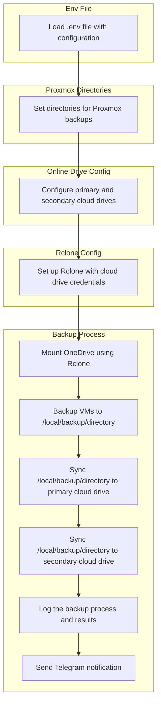

<h1 align="center">Proxmox Backup Scripts</h1>

### Table of Contents
- [Table of Contents](#table-of-contents)
- [Introduction](#introduction)
- [Workflow](#workflow)
- [Prerequisites](#prerequisites)
- [Env file store sensitive infomation](#env-file-store-sensitive-infomation)
- [Backup Scripts](#backup-scripts)
- [Backup Result](#backup-result)
- [Schedule Backup with Crontab](#schedule-backup-with-crontab)

### Introduction
This guide provides a detailed workflow for backing up Proxmox virtual machines (VMs) to both local and cloud storage. The process involves loading environment configurations, setting up directories, configuring cloud drives, and using Rclone for synchronization. By following this workflow, you can ensure that your Proxmox VMs are securely backed up and synchronized across multiple storage locations.

### Workflow

<div align="right">
    <a href="#table-of-contents">
        <button>
            🔙 Back to Table of Contents
        </button>
    </a>
</div>



### Prerequisites

<div align="right">
    <a href="#table-of-contents">
        <button>
            🔙 Back to Table of Contents
        </button>
    </a>
</div>

Follow the instructions on the [Rclone website](https://rclone.org/install/) to install Rclone on your system.

Example for Linux:
```bash
curl https://rclone.org/install.sh | sudo bash
```

### Env file store sensitive infomation

<div style="text-align: right;">
    <a href="#table-of-contents" style="font-size: 12px; padding: 5px 10px; background-color: #007bff; color: white; text-decoration: none; border-radius: 5px;">Back to Table of Contents</a>
</div>

Create a .env file in your working directory with the following content:
```bash
# =====================
# Miscellaneous
# =====================

# Miscellaneous configurations like paths for additional scripts and environment settings.
SCRIPTS_DIR='/root/scripts'  # Directory where additional scripts, including this backup script, are stored.
ENV_FILE="$SCRIPTS_DIR/.env"  # Path to the environment file where other environment variables are set.
DATE=$(date +'%Y-%m-%d')  # Current date, used for naming backups and logs.

# =====================
# Proxmox Directories 
# =====================

# The directories related to Proxmox, including template cache, ISOs, and local backup location.
TEMPLATE_CACHE_DIR="/var/lib/vz/template/cache/"  # Directory where Proxmox stores template cache files.
ISO_DIR="/var/lib/vz/template/iso/"  # Directory where Proxmox stores ISO images.
VZ_BACKUP_DIR="/var/lib/vz/dump/"  # Directory where Proxmox stores local container backups
SNIPPETS_DIR="/var/lib/vz/snippets/" # Directory where Proxmox stores local snippets cloud-init
LOG_FILE="/var/log/proxmox_backup_$DATE.log"  # Log file for backup processes, $DATE will be replaced by the current date.

# =====================
# Online Drive Config
# =====================

# The configuration for online backup destinations, including primary and secondary drives.
PRIMARY_BACKUP_DRIVE="[YOUR_PRIMARY_ONLINE_DRIVE]:/backups/Proxmox"  # Path to the primary cloud backup destination.
VZ_BACKUP_DRIVE="$PRIMARY_BACKUP_DRIVE/$DATE/vzdump"  # Directory for storing vzdump backups on the primary cloud drive, named by the current date.
SECONDARY_BACKUP_DRIVE="[YOUR_SECONDARY_ONLINE_DRIVE]:/backups/Proxmox"  # Path to the secondary cloud backup destination, used for syncing backups. It's optional setting.

# =====================
# Rclone Config
# =====================

# Rclone configuration for mounting OneDrive and syncing data to cloud.
MOUNT_POINT="/root/onedrive_backup"  # Directory where OneDrive will be mounted for backup.
MOUNT_POINT_BACKUP_DIR="$MOUNT_POINT/backups/Proxmox"  # Backup directory inside OneDrive mount point.
VZ_MOUNT_POINT=$MOUNT_POINT_BACKUP_DIR/vzdump  # Directory for vzdump backup inside OneDrive mount point.
RCLONE_CONFIG='/root/.config/rclone/rclone.conf'  # Path to the rclone configuration file used to set up cloud connections.

# =====================
# Telegram Bot Settings
# =====================

# Telegram bot details to send notifications regarding backup status.
BOT_TOKEN="TELEGRAM_BOT_TOKEN"  # Telegram bot token for authentication.
CHAT_ID="-[CHAT_ID_NUMBER]"  # The Telegram chat ID to send messages to (usually a group chat ID).
THREAD_ID="[THREAD_TOPIC_ID]"  # Telegram message thread ID for sending messages in a specific thread.

# =====================
# Temporary Backup Storage
# =====================

# Temporary directory for backup storage during the backup process.
ROOT_TEMP_BACKUP_DIR="/zfs/proxmox_backups"  # Root directory for temporary backups
TEMP_BACKUP_DIR="/zfs/proxmox_backups/$DATE"  # Directory for temporary backups, created dynamically based on the current date.
VZ_TEMP_BACKUP_DIR="$TEMP_BACKUP_DIR/vzdump"  # Directory for vzdump, created dynamically based on the current date.
```
<div style="text-align: right;">
    <a href="#table-of-contents" style="font-size: 12px; padding: 5px 10px; background-color: #007bff; color: white; text-decoration: none; border-radius: 5px;">Back to Table of Contents</a>
</div>

### Backup Scripts

<div align="right">
    <a href="#table-of-contents">
        <button>
            🔙 Back to Table of Contents
        </button>
    </a>
</div>

Create a proxmox_backup.sh script with the following content:
```bash
#!/bin/bash

# Load environment variables from .env file
ENV_FILE="${SCRIPTS_DIR}/.env"

if [[ -f "$ENV_FILE" ]]; then
    source "$ENV_FILE"
    log_message "Environment file $ENV_FILE loaded successfully."
else
    echo "Environment file $ENV_FILE not found. Exiting."
    exit 1
fi


# Function to log messages
log_message() {
    local message="$1"
    echo "$message" | tee -a "$LOG_FILE"
}

# Function to send notification to Telegram
send_telegram() {
    local message="$1"
    curl -s -X POST -H "Content-Type: application/json" \
         -d "{\"chat_id\": \"$CHAT_ID\", \"message_thread_id\": \"$THREAD_ID\", \"text\": \"$message\"}" \
         "https://api.telegram.org/bot$BOT_TOKEN/sendMessage" > /dev/null
}

# Function to create necessary directories before backup
create_backup_dirs() {
    log_message "Creating necessary directories..."

    # Array of directories to ensure they exist
    local dirs_to_create=(
        "$MOUNT_POINT"               # OneDrive mount point
        "$VZ_BACKUP_DIR"             # Directory where Proxmox stores local container backups
        "$VZ_TEMP_BACKUP_DIR"        # Temporary vzdump files
        "$ROOT_TEMP_BACKUP_DIR"      # Root-level temporary backup directory
        "$TEMP_BACKUP_DIR"           # General temporary backup directory
        "$TEMPLATE_CACHE_DIR"        # Template cache directory
        "$SNIPPETS_DIR"              # Template Cloud Init
        "$ISO_DIR"                   # ISO directory
        "$SCRIPTS_DIR"               # Directory where additional scripts, including this backup script, are stored
    )

    # Loop through each directory and create it if it doesn't exist
    for dir in "${dirs_to_create[@]}"; do
        # Check if the directory exists before trying to create it
        if [[ ! -d "$dir" ]]; then
            log_message "Creating directory $dir..."
            mkdir -p "$dir" || log_message "Failed to create $dir."
        else
            log_message "Directory $dir already exists."
        fi
    done

    log_message "Directories created successfully."
}

# Function to clean up old vzdump files on local storage, keeping at least 2 most recent
cleanup_old_vzdump_files() {
    if [ -d "$VZ_BACKUP_DIR" ]; then
        log_message "Cleaning up old local vzdump files in $VZ_BACKUP_DIR, keeping at least 2 most recent..."

        # Find all .tar.gz, .tar.zst, and .log files
        find "$VZ_BACKUP_DIR" -type f \( -name "*.tar.gz" -o -name "*.tar.zst" -o -name "*.log" \) \
            | while IFS= read -r file; do
                # Extract the container or VM ID from the file name (supporting both lxc and qemu)
                container_id=$(echo "$file" | sed -E 's/.*vzdump-(lxc|qemu)-([0-9]+)-.*/\2/')

                # Group files by container ID and sort them by modification time
                # Get the list of files related to the current container
                all_files=$(find "$VZ_BACKUP_DIR" -type f -name "vzdump-*-${container_id}-*" | sort -t'-' -k3,3nr)

                # Keep only the 2 most recent backups for this container (files of all types)
                files_to_delete=$(echo "$all_files" | tail -n +3)

                # Delete old files for the current container
                if [ -n "$files_to_delete" ]; then
                    echo "$files_to_delete" | while IFS= read -r old_file; do
                        log_message "Deleting old file: $old_file"
                        rm -f "$old_file"
                    done
                fi
            done

        log_message "Old local vzdump files cleanup completed."
    else
        log_message "Directory $VZ_BACKUP_DIR not found, skipping cleanup."
    fi
}

# Function to clean up old backups on One line Drive, keeping only the 15 most recent
cleanup_onedrive_backups() {
    log_message "Cleaning up old backups on One line Drive, keeping only the 15 most recent..."
    cd "$BACKUP_DIR" || exit
    for dir in */; do
        if [[ -d "$dir" ]]; then
            find "$dir" -type f \( -name '*.tar.gz' -o -name '*.vma.gz' -o -name '*.vma.zst' \) -printf '%T@ %p\n' | sort -n | awk 'NR>15 {print $2}' | xargs -r rm -- 
        fi
    done
    log_message "One line Drive backup cleanup completed."
}

# Check if One line Drive is already mounted, and mount if necessary
check_and_mount_onedrive() {
    # Check if fuse3 is installed, if not, install it
    if ! command -v fusermount3 &> /dev/null; then
        log_message "fuse3 is not installed. Installing fuse3..."
        if ! apt update && apt install -y fuse3; then
            log_message "Failed to install fuse3. Exiting."
            send_telegram "🔴 Failed to install fuse3 for $(hostname) on $DATE."
            exit 1
        fi
        log_message "fuse3 installed successfully."
    fi

    # Check if One line Drive is already mounted
    if mount | grep "$MOUNT_POINT" > /dev/null; then
        log_message "One line Drive is already mounted."
    else
        log_message "Mounting One line Drive..."
        
        # Unmount in case there is an old mount lingering
        fusermount -u "$MOUNT_POINT" 2>/dev/null
        
        # Attempt to mount One line Drive
        if ! rclone mount "$PRIMARY_BACKUP_DRIVE" "$MOUNT_POINT" --daemon --allow-non-empty --vfs-cache-mode writes -vv; then
            log_message "Failed to mount One line Drive. Exiting."
            send_telegram "🔴 Failed to mount One line Drive for $(hostname) on $DATE."
            exit 1
        fi
        log_message "One line Drive mounted successfully."
    fi
}

# Function to clean up temporary backup files
cleanup_temp_files() {
    log_message "Cleaning up temporary backup files in $VZ_MOUNT_POINT/$DATE..."
    rm -rf "$ROOT_TEMP_BACKUP_DIR" 2>/dev/null || log_message "No temporary files to clean up."
}

# Function to perform the backup
perform_backup() {
    log_message "Starting configuration backups..."
    
    # Create a directory for backups (temporary backup directory for the current day)
    mkdir -p "$TEMP_BACKUP_DIR" || log_message "Failed to create backup dir"
    
	# Copy template data to One line Drive
    log_message "Copying template data to Oneline Drive..."
	echo "Copying template data to Oneline Drive..."
    rclone_copy "$TEMPLATE_CACHE_DIR" "$PRIMARY_BACKUP_DRIVE/template/cache"
    rclone_copy "$ISO_DIR" "$PRIMARY_BACKUP_DRIVE/template/iso"
	rclone_copy "$SCRIPTS_DIR" "$PRIMARY_BACKUP_DRIVE/scripts"
    # Paths to compress, including new configurations
    local paths_to_backup=( 
        "/etc/pve"
        "/etc/network"
        "/etc/pve/storage.cfg"
        "/etc/pve/user.cfg"
    )

    # Compress configuration files
    for path in "${paths_to_backup[@]}"; do
        local tar_file="$TEMP_BACKUP_DIR/$(basename "$path").tar"
        log_message "Compressing $path to $tar_file..."
        tar -cvf "$tar_file" "$path" 2>/dev/null || log_message "Failed to compress $path."
    done

    # Copy compressed configuration files to One line Drive under the $DATE directory
    log_message "Copying configuration backup files to One line Drive..."
	echo "Copying BACKUP data to One line Drive..."
    rclone_copy "$TEMP_BACKUP_DIR" "$PRIMARY_BACKUP_DRIVE/$DATE"
	# Copy dump files to One line Drive under the $DATE directory
	echo "Starting vzdump backup for all VMs and containers to "$TEMP_BACKUP_DIR""
    vzdump --mode snapshot --compress zstd --all "$VZ_TEMP_BACKUP_DIR"
	echo "Copy from "$VZ_TEMP_BACKUP_DIR" to "$VZ_BACKUP_DIR""
	cp -r "$VZ_TEMP_BACKUP_DIR" "$VZ_BACKUP_DIR"
	echo "rclone copy from $TEMP_BACKUP_DIR to "$VZ_BACKUP_DRIVE""
	rclone_copy "$VZ_TEMP_BACKUP_DIR" "$VZ_BACKUP_DRIVE"
    log_message "Backup completed."
}

# rclone copy function for backup files with detailed Telegram notifications
rclone_copy() {
    local source_path="$1"
    local destination_path="$2"

    log_message "Starting copy from $source_path to $destination_path..."

    if rclone copy "$source_path" "$destination_path" -v --progress --checksum --checkers 10 --transfers 10 --drive-server-side-across-configs --copy-links; then
        log_message "Copied $source_path to $destination_path"
    else
        log_message "Failed to copy $source_path to $destination_path"
        send_telegram "🔴 Failed to copy $source_path to $destination_path"
    fi
}

# rclone sync function for syncing directories with detailed logging and notifications
rclone_sync() {
    local source_path="$1"
    local destination_path="$2"
    
    log_message "Starting sync from $source_path to $destination_path..."

    # Use rclone sync with additional options for robustness, including --delete-after
    if rclone sync "$source_path" "$destination_path" -v --progress --checksum --checkers 10 --transfers 10 --drive-server-side-across-configs --copy-links --delete-after; then
        log_message "Successfully synced $source_path to $destination_path"
    else
        log_message "Failed to sync $source_path to $destination_path"
        send_telegram "🔴 Failed to sync from $source_path to $destination_path"
    fi

    log_message "Sync operation completed for $source_path."
}

# Function to sync backups to secondary One line Drive using rclone_sync
sync_to_secondary() {
    log_message "Syncing backup to secondary One line Drive..."
    rclone_sync "$PRIMARY_BACKUP_DRIVE" "$SECONDARY_BACKUP_DRIVE"
    log_message "Secondary One line Drive sync completed."
}

# Notify start of backup
send_telegram "🟢 Starting daily Proxmox backup for $(hostname) on $DATE."

# Create necessary directories
create_backup_dirs

# Check and mount One line Drive
check_and_mount_onedrive

# Perform backup
perform_backup

# Sync to secondary One line Drive
sync_to_secondary

# Cleanup old local vzdump files
cleanup_old_vzdump_files

# Cleanup old backups on One line Drive
cleanup_onedrive_backups

# Cleanup temporary files
cleanup_temp_files
# Notify completion of backup
send_telegram "✅ Proxmox backup completed successfully for Node:$(hostname) on $DATE."
```
### Backup Result

<div align="right">
    <a href="#table-of-contents">
        <button>
            🔙 Back to Table of Contents
        </button>
    </a>
</div>

The backup script will create the following directory structure on OneDrive:
```bash
onedrive_backup/
├── 2024-11-07                  # Directory for backup performed on a specific date (e.g., 2024-11-07). It contains all the backup files for that day.
│   ├── network.tar             # Backup of the network configuration in Proxmox.
│   ├── pve.tar                 # Backup of the main Proxmox VE configuration, including specific system settings.
│   ├── storage.cfg.tar         # Backup of the storage configuration in Proxmox (disk, directories, etc.).
│   ├── user.cfg.tar            # Backup of user configuration on Proxmox (permissions and users).
│   └── vzdump                  # Directory for the backup of Proxmox containers (LXC) and virtual machines (VM).
│       ├── vzdump-lxc-104-2024_11_07-09_49_05.log
│       ├── vzdump-lxc-104-2024_11_07-09_49_05.tar.zst
│       ├── vzdump-lxc-104-2024_11_07-10_45_09.log
│       ├── vzdump-lxc-104-2024_11_07-10_45_09.tar.zst
│       ├── vzdump-lxc-8001-2024_11_07-09_49_18.log
│       ├── vzdump-lxc-8001-2024_11_07-09_49_18.tar.zst
│       ├── vzdump-lxc-8001-2024_11_07-10_45_22.log
│       ├── vzdump-lxc-8001-2024_11_07-10_45_22.tar.zst
│       ├── vzdump-lxc-8002-2024_11_07-09_49_23.log
│       ├── vzdump-lxc-8002-2024_11_07-09_49_23.tar.zst
│       ├── vzdump-lxc-8002-2024_11_07-10_45_27.log
│       ├── vzdump-lxc-8002-2024_11_07-10_45_27.tar.zst
│       ├── vzdump-lxc-8003-2024_11_07-09_49_27.log
│       ├── vzdump-lxc-8003-2024_11_07-09_49_27.tar.zst
│       ├── vzdump-lxc-8003-2024_11_07-10_45_32.log
│       └── vzdump-lxc-8003-2024_11_07-10_45_32.tar.zst
├── scripts
│   └── proxmox_backup.sh       # Main script to perform Proxmox backup, including container/VM backups and configuration files.
└── template
    ├── cache                   # Directory containing system template cache, including pre-built OS templates.
    │   ├── debian-12-standard_12.7-1_amd64.tar.zst    # Debian 12 standard OS template.
    │   ├── debian-12-turnkey-ansible_18.0-1_amd64.tar.gz  # Debian 12 template with default Ansible settings.
    │   ├── debian-12-turnkey-openvpn_18.0-1_amd64.tar.gz  # Debian 12 template with OpenVPN pre-installed.
    │   ├── debian-12-turnkey-wireguard_18.1-1_amd64.tar.gz # Debian 12 template with WireGuard pre-installed.
    │   ├── ubuntu-20.04-standard_20.04-1_amd64.tar.gz  # Ubuntu 20.04 standard OS template.
    │   ├── ubuntu-22.04-standard_22.04-1_amd64.tar.zst  # Ubuntu 22.04 standard OS template.
    │   └── ubuntu-24.04-standard_24.04-2_amd64.tar.zst  # Ubuntu 24.04 standard OS template.
    └── iso
        ├── focal-server-cloudimg-amd64.img  # Image of Ubuntu 20.04 Cloud for cloud deployments.
        ├── jammy-server-cloudimg-amd64.img  # Image of Ubuntu 22.04 Cloud.
        └── noble-server-cloudimg-amd64.img  # Image of Ubuntu 24.04 Cloud.
```

### Schedule Backup with Crontab

<div align="right">
    <a href="#table-of-contents">
        <button>
            🔙 Back to Table of Contents
        </button>
    </a>
</div>

To schedule the backup script to run every 2 days at 1AM, you can add the following line to your crontab file:

1. Open the crontab file for editing:
    ```bash
    crontab -e
    ```

2. Add the following line to schedule the script:
    ```bash
    0 1 */2 * * /path/to/your/backup_script.sh
    ```

This line means:
- `0 1 */2 * *`: Run the script at 1:00 AM every 2 days.
- `/path/to/your/backup_script.sh`: Replace this with the actual path to your backup script.

Save and close the crontab file. The backup script will now run automatically according to the schedule.