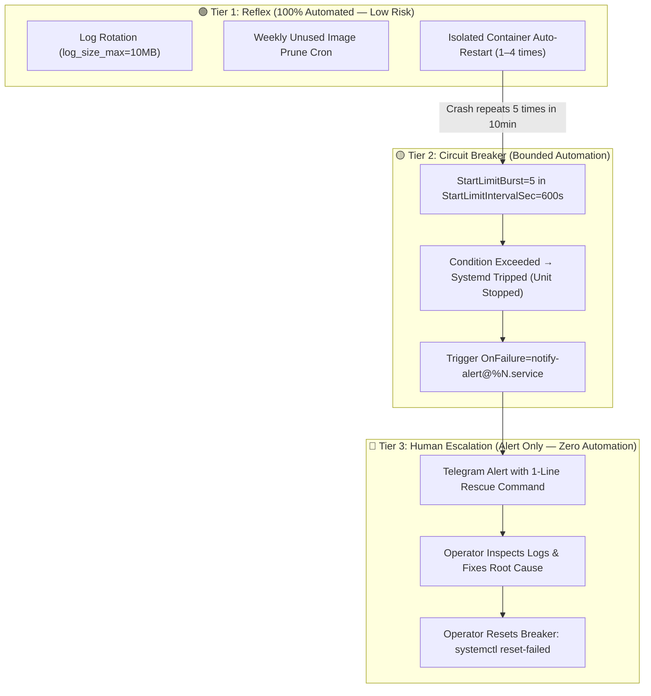

# ⚡ Bounded Self-Healing & Systemd Circuit Breaker Pattern

> **System Design Focus**: Preventing Cascading Failures, CPU/IO Meltdowns, and Alert Storms using Bounded Restarts and OnFailure Triage Hooks.

---

## 💡 The Core Analogy: The Electrical Circuit Breaker (Cầu Dao Điện)

> In your home electrical system, when a wire shorts, you do not want the power line to keep feeding electricity indefinitely until your house catches fire. You install a **circuit breaker** (cầu dao) that instantly **trips and cuts the power** when current exceeds safe boundaries.
>
> In container orchestration, infinite auto-restarts (`Restart=always`) are a short circuit. If a database is corrupted or disk is full, the container crashes, restarts, crashes again, 50 times per minute. This **burns 100% CPU, saturates disk IOPS, and floods your phone with 500 alerts**.
>
> **The Systemd Circuit Breaker trips the breaker after 5 failures in 10 minutes**, halts the restart storm, and fires a single, structured distress signal with a copy-pasteable rescue command.

---

## 🧠 The 3-Tier Self-Healing Hierarchy

A resilient homelab must not treat all failures equally. We categorize recovery into 3 distinct tiers:



---

## 🔍 Deep WHAT → HOW → WHY

### 1. WHAT: The Problem with Default `Restart=always`
Most Docker Compose tutorials blindly recommend `restart: always` or `Restart=always`. Under a fatal configuration syntax error, missing secret, or database corruption:
- The container restarts in a tight loop (~20ms per cycle).
- Systemd journal or Docker logs fill gigabytes of disk per hour with identical error traces.
- CPU spikes to 100% on container runtime initialization.

---

### 2. HOW: The Mechanism of Bounded Healing

In Systemd, we constrain the restart loop using three load-bearing directives in the `[Unit]` section:

```ini
[Unit]
Description=My Application Container
# Allow maximum 5 restart attempts...
StartLimitBurst=5
# ...within any 10-minute (600s) rolling window
StartLimitIntervalSec=600
# When breaker trips, automatically trigger the alert dispatcher unit
OnFailure=notify-alert@%N.service

[Service]
Restart=on-failure
RestartSec=5s
```

When the service fails for the 5th time within 10 minutes:
1. Systemd enters `failed` state and **stops attempting further restarts**.
2. Systemd automatically evaluates `OnFailure` and invokes `notify-alert@<service-name>.service`.
3. The template unit executes `/usr/local/bin/telegram-alert.sh`, which formats a rich HTML distress message with container metadata and the exact recovery command.

---

### 3. WHY: Actionable Rescue Message Format

A notification is useless if the operator has to remember arcane CLI flags while on mobile. The alert message must deliver **immediate situational awareness**:

```html
🔴 <b>[CB] Circuit Breaker Tripped</b>

<b>Service:</b> <code>traefik-podman.service</code>
<b>Host:</b> svc-traefik-prod (10.0.0.34)
<b>Symptom:</b> 5 crashes in 10min → Auto-restart <b>DISABLED</b> to protect CPU/IO.

<b>Troubleshooting:</b>
<code>journalctl -u traefik-podman.service -n 30 --no-pager</code>

<b>Recovery after fix:</b>
<code>systemctl reset-failed traefik-podman.service && systemctl start traefik-podman.service</code>
```

---

## 🛠️ Step-by-Step Implementation Runbook

### Step 1: Deploy Alert Script
Copy `telegram-alert.sh` to `/usr/local/bin/telegram-alert.sh` and make executable:
```bash
chmod 755 /usr/local/bin/telegram-alert.sh
```

### Step 2: Deploy Systemd Template Unit
Copy `notify-alert@.service` to `/etc/systemd/system/notify-alert@.service`:
```ini
[Unit]
Description=Circuit Breaker Alert Dispatcher for %i

[Service]
Type=oneshot
ExecStart=/usr/local/bin/telegram-alert.sh "%i"
```

### Step 3: Test Circuit Breaker Kill-Test
To verify that your circuit breaker trips and alerts correctly without crashing a real service:
1. Create a dummy crash service `/etc/systemd/system/test-crash.service` with `ExecStart=/bin/false`, `Restart=always`, `StartLimitBurst=5`, `StartLimitIntervalSec=600`, `OnFailure=notify-alert@%N.service`.
2. Run `systemctl daemon-reload && systemctl start test-crash.service`.
3. Observe: The service attempts 5 starts, trips to `failed (Result: start-limit-hit)`, and your Telegram receives the `[CB]` alert within 5 seconds.
