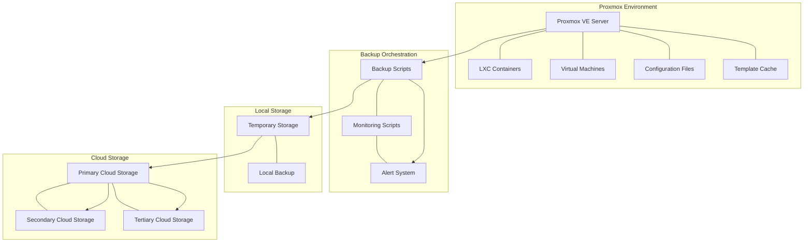

# Proxmox Backup System Architecture

This document outlines the architecture of the Proxmox backup system and explains how different components interact.

## System Architecture Overview

## Component Descriptions

### Proxmox Environment

- **Proxmox VE Server**: The main hypervisor that hosts containers and VMs
- **LXC Containers**: Linux containers managed by Proxmox
- **Virtual Machines**: KVM/QEMU virtual machines
- **Configuration Files**: System and container configurations
- **Template Cache**: Cached template files for container creation

### Backup Orchestration

- **Backup Scripts**: Main scripts that orchestrate the backup process
  - `proxmox_backup.sh`: Main controller script
  - `clean_old_vzdump.sh`: Cleanup utility
- **Monitoring Scripts**: Scripts that monitor the backup process
  - `install_exporter.sh`: Exports metrics to Prometheus
- **Alert System**: Telegram notification system

### Storage Components

- **Temporary Storage**: Intermediate storage for backup operations
  - Path: `/zfs/proxmox_backups/$DATE`
- **Local Backup**: Local persistent storage for backups
  - Path: `/var/lib/vz/dump/`
- **Cloud Storage**: Remote storage locations
  - Primary: `backup-primary.example.lab:/backups/Proxmox`
  - Secondary: `backup-secondary.example.net:/backups/Proxmox`
  - Tertiary: `backup-tertiary.example.org:/IT/backups/Proxmox`

## Data Flow

1. **Backup Initiation**
   - Triggered by cron job or manual execution
   - Script creates necessary directory structure

2. **Configuration Backup**
   - Critical system configurations backed up first
   - Includes `/etc/pve`, `/etc/network`, etc.

3. **Container/VM Snapshots**
   - `vzdump` creates snapshots of all containers and VMs
   - Uses ZFS snapshots when available for efficiency

4. **Local Storage**
   - Backups temporarily stored in `/zfs/proxmox_backups/$DATE`
   - Copies also placed in local backup directory `/var/lib/vz/dump/`

5. **Cloud Synchronization**
   - `rclone` syncs backups to primary cloud storage
   - From primary, syncs to secondary and tertiary locations

6. **Cleanup and Retention**
   - Removes temporary files
   - Enforces retention policies (2 local copies, 15 cloud copies)

7. **Notification**
   - Sends status updates to Telegram throughout the process
   - Final notification when complete

## Security Considerations

1. **Authentication**
   - Cloud storage access secured through rclone credentials
   - All scripts run with appropriate permissions

2. **Encryption**
   - Data can be encrypted during transfer to cloud storage
   - Optional at-rest encryption for sensitive backups

3. **Access Control**
   - Backup files only accessible to root user
   - Cloud storage secured through appropriate IAM policies

## Scaling Considerations

1. **Storage Scaling**
   - Local storage monitored for capacity
   - Cloud storage offers virtually unlimited expansion

2. **Performance**
   - Temporary storage on ZFS for snapshot efficiency
   - Compression (zstd) balances size and speed

3. **Multiple Nodes**
   - Architecture supports backing up multiple Proxmox nodes
   - Each node can use the same cloud storage destinations