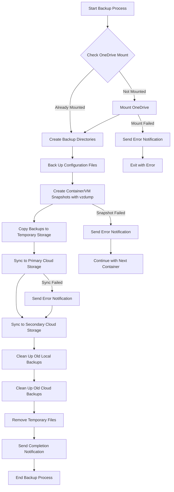
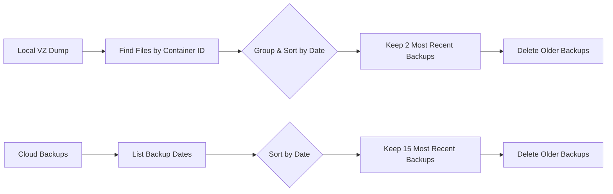
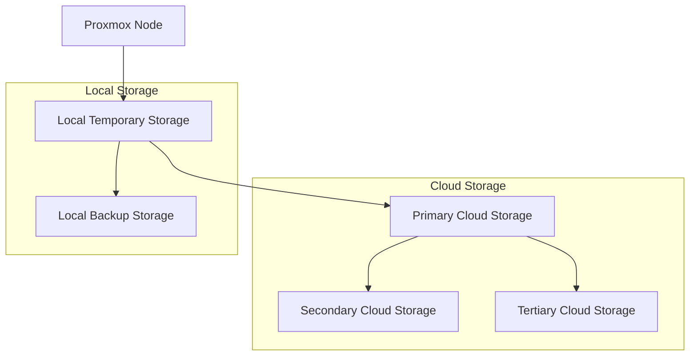
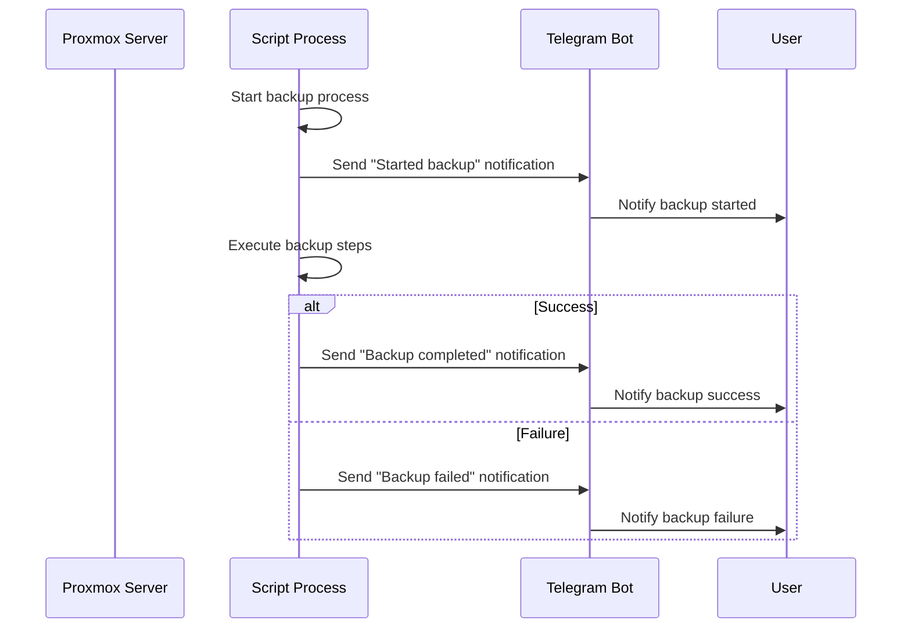

# Proxmox Backup Workflow

This document illustrates the workflow of the Proxmox backup system using Mermaid diagrams.

## Main Backup Process

## Backup File Management

## Data Flow Architecture

## Notification System

