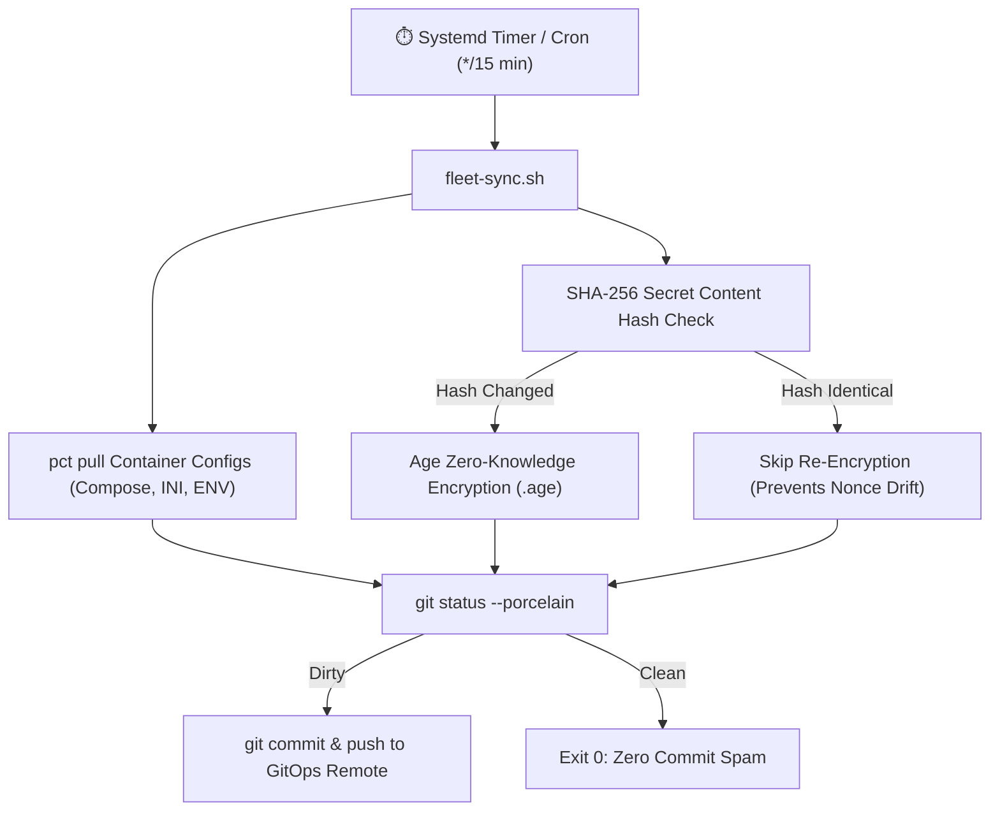

# ⚙️ Proxmox Fleet GitOps Reconciler & Zero-Spam State Synchronizer

> **Automated, Content-Addressable Drift Reconciliation with Age Zero-Knowledge Secret Encryption for Proxmox VE.**

---

## 📌 The Problem with Naive GitOps

In a homelab with 15-20+ LXC containers, naive periodic cron syncs (`git commit -am "periodic backup"`) cause:
1. **Commit Spam**: Hundreds of empty or trivial commits cluttering Git history every day.
2. **Secret Exposure**: Plaintext `.env` or password files committed to version control.
3. **Encryption Drift Loops**: Encrypting files with random nonces changes the ciphertext every cycle, creating fake diffs.

---

## 🛠️ The Architecture Solution



---

## 🚀 Setup Instructions

1. **Install Prerequisites on Hypervisor**:
   ```bash
   apt-get install -y git age
   ```

2. **Generate Age Keypair**:
   ```bash
   age-keygen -o /etc/homelab/recovery.key
   # Public key will be displayed: age1...
   ```

3. **Deploy the Script**:
   ```bash
   cp fleet-sync.sh.template /opt/gitops/fleet-sync.sh
   chmod +x /opt/gitops/fleet-sync.sh
   # Edit variables: GITOPS_DIR, CONTAINER_LIST, AGE_RECIPIENT
   ```

4. **Schedule via Cron**:
   ```bash
   # /etc/cron.d/fleet-gitops
   */15 * * * * root /opt/gitops/fleet-sync.sh >> /var/log/fleet-sync.log 2>&1
   ```
