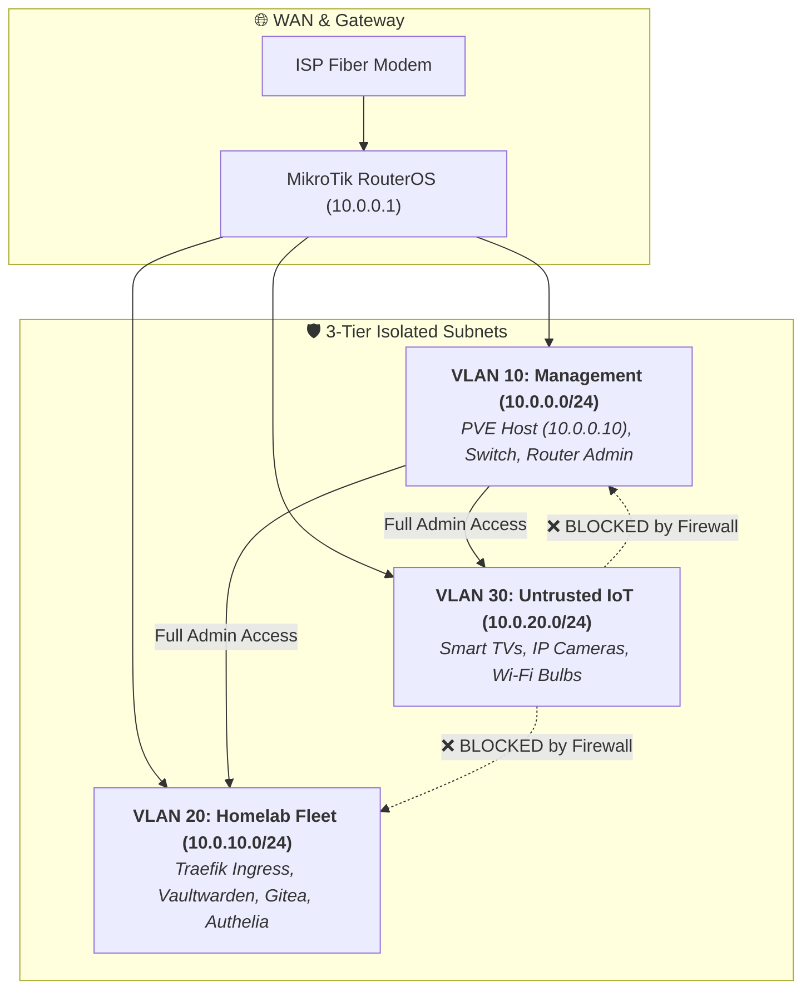

# 🌐 MikroTik RouterOS: Network Micro-Segmentation & Split-Horizon DNS

> **System Design Focus**: Layer 2 VLAN Isolation, Zero-Trust Subnet Boundaries, and Split-Horizon Internal DNS Routing.

---

## 💡 The Core Analogy: The Hotel Keycard System

> In an insecure flat network, if a smart bulb or IoT camera gets hacked, the attacker can immediately scan your Proxmox server and Vaultwarden instance because everyone is in the same open room.
>
> **VLAN Micro-Segmentation is a modern hotel keycard**: Guests (IoT devices on VLAN 30) can only access the hallway to the internet. They **cannot open the door to the Management suite (VLAN 10) or Core Services (VLAN 20)**.

---

## 🏗️ Network Topology & VLAN Segmentation

---

## 🚀 Quick Deployment Guide

1. Open WebFig or WinBox on your MikroTik Router.
2. In Terminal, paste the commands from [`routeros-hardening.rsc`](routeros-hardening.rsc).
3. Verify that IoT devices receive IP addresses in `10.0.20.0/24` and cannot ping `10.0.0.10` (Proxmox Host).
