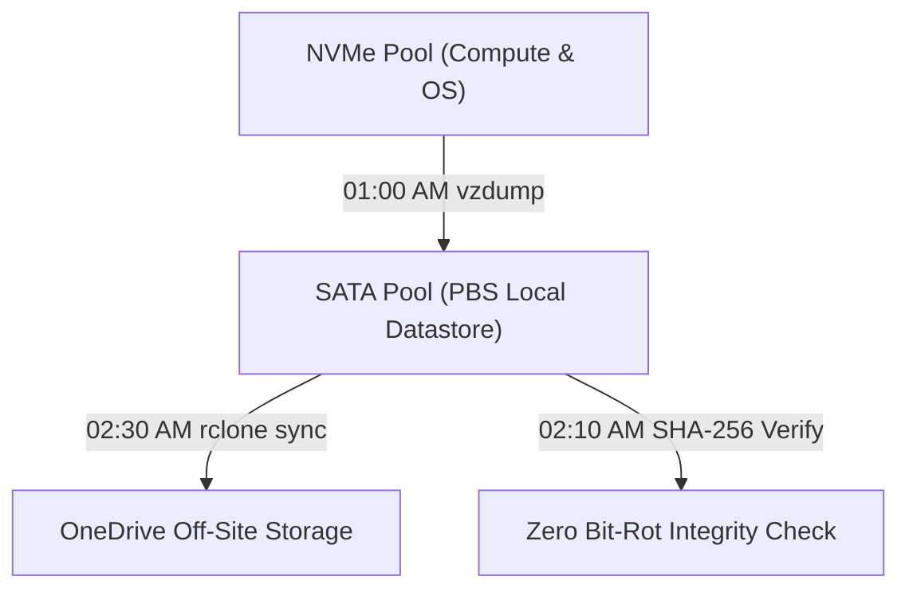

# 💾 Proxmox Backup Server (PBS) 5-Stage Consolidation & True 3-2-1 Architecture

This production blueprint codifies the enterprise 5-stage backup consolidation lifecycle, ensuring zero data loss, database consistency, cryptographic SHA-256 chunk verification, and dual-track cloud replication.

## 🏛️ The 5-Stage Closed-Loop Lifecycle

| Stage | Schedule | Location | Component | Technical Action |
|:---:|:---:|:---:|:---|:---|
| **Stage 1** | `00:30 AM` | Fleet Containers | `fleet-sqlite-backup.py` | Atomic WAL checkpoint (`PRAGMA wal_checkpoint(TRUNCATE)`) & `PRAGMA integrity_check`. |
| **Stage 2** | `01:00 AM` | PVE Hypervisor | `pvescheduler` (vzdump) | Non-blocking snapshot ingest, chunk streaming over TLS port 8007. |
| **Stage 3** | `01:45 AM` | PBS Container | `proxmox-backup-manager prune-job` | Grandfather-Father-Son retention enforcement (Keep 7 Daily / 4 Weekly / 3 Monthly). |
| **Stage 4** | `02:10 AM` | PBS Container | `proxmox-backup-manager verify-job` | Full datastore cryptographic audit (SHA-256 checksum against manifest). |
| **Stage 5** | `02:30 AM` | PBS Container | `pbs-cloud-sync.service` | Track A: Chunks sync (`rclone`). Track B: Emergency Flat DB export. Telegram Topic 5 alert. |

## 🛡️ True 3-2-1 Architecture Topology

