# 🦭 Daemonless Podman on Proxmox LXC: Next-Gen Container Standard

> **System Design Focus**: Eliminating Docker VM overhead and Docker-in-LXC daemon vulnerabilities in favor of native Linux Systemd container orchestration.

---

## 💡 The Core Analogy: Direct Ownership vs The Middleman

> Traditional Docker is like hiring a full-time concierge (the Docker Daemon) who must stay in the lobby 24/7, consuming food and electricity, just to open the door for a guest. If the concierge faints, nobody can enter or leave the building.
>
> **Podman is a direct key**: When you launch a container, Linux kernel cgroups and namespaces create the process directly. Systemd manages the container like any native Linux service (`nginx`, `sshd`). There is **zero background daemon consuming idle RAM or acting as a single point of failure**.

---

## 🏗️ Architecture Comparison: Docker VM vs Podman in LXC

```mermaid
flowchart TD
    subgraph Traditional_VM["❌ Legacy Pattern: Docker inside Full Linux VM"]
        PVE1["Proxmox VE Hypervisor"]
        KVM["Full QEMU/KVM Virtual Machine (1.5GB RAM static overhead)"]
        DockerDaemon["Docker Daemon (Root socket /var/run/docker.sock)"]
        Container1["Application Container"]
        PVE1 --> KVM --> DockerDaemon --> Container1
    end

    subgraph Podman_LXC["✅ Modern Standard: Podman in Unprivileged LXC"]
        PVE2["Proxmox VE Hypervisor"]
        LXC["Unprivileged LXC Container (~30MB RAM overhead)"]
        Systemd["Native Linux Systemd (*-podman.service)"]
        Container2["Daemonless Container Process"]
        PVE2 --> LXC --> Systemd --> Container2
    end
```



---

## 🧠 The 3-Layer Cognitive Model (WHAT → HOW → WHY)

### 1. WHAT: The Architecture
Each application domain (e.g., `svc-traefik-prod`, `svc-vaultwarden-prod`, `svc-gitea-prod`) runs inside its own isolated, unprivileged Proxmox LXC container. Inside the LXC, Podman runs the container image, managed as a native systemd unit.

---

### 2. HOW: Enabling Podman inside Proxmox LXC

To run Podman inside an unprivileged LXC container without security compromises, Proxmox requires two specific feature flags:

```bash
# In Proxmox host container configuration (/etc/pve/lxc/<VMID>.conf):
features: nesting=1,keyctl=1
unprivileged: 1
```

- **`nesting=1`**: Allows the container to manage its own child namespaces (required for Podman to create container network and mount namespaces).
- **`keyctl=1`**: Enables kernel keyring management per container, preventing crypto token collision while preserving host kernel boundary.

---

### 3. WHY: System Design Advantages

| Attribute | Docker inside Full VM | Docker inside LXC | Podman inside LXC |
|:---|:---|:---|:---|
| **RAM Overhead** | High (1.5GB – 2.0GB per VM) | Low (~50MB) | **Ultra-Low (~30MB)** |
| **Startup Time** | 30–60s (Full OS Boot) | 2–5s | **<1s (Instant Process Spawn)** |
| **Daemon Failure Risk** | Daemon crash kills all containers | Daemon crash kills all containers | **Zero (Daemonless process model)** |
| **Orchestrator** | Docker Compose CLI / Swarm | Docker Compose CLI | **Native Linux Systemd Units** |
| **Auto-Start on Boot** | Relies on Docker daemon start | Relies on Docker daemon start | **Standard `systemctl enable`** |

---

## 🛠️ Automated Provisioning Script

Use `create_podman_lxc.sh` on your Proxmox VE host to provision a production-grade Podman LXC in 15 seconds:

```bash
chmod +x create_podman_lxc.sh
./create_podman_lxc.sh 110 svc-app-prod 10.0.0.110/24 10.0.0.1 8G 1024 1 local-lvm
```

### Systemd Integration Template
Inside the container, create `/etc/systemd/system/myapp-podman.service`:
```ini
[Unit]
Description=MyApp Podman Container
After=network-online.target
Wants=network-online.target
StartLimitBurst=5
StartLimitIntervalSec=600
OnFailure=notify-alert@%N.service

[Service]
Type=simple
Restart=on-failure
RestartSec=5s
ExecStartPre=-/usr/bin/podman stop myapp
ExecStartPre=-/usr/bin/podman rm myapp
ExecStart=/usr/bin/podman run --name myapp --rm -p 8080:80 docker.io/library/nginx:alpine
ExecStop=/usr/bin/podman stop -t 10 myapp

[Install]
WantedBy=multi-user.target
```
Activate with: `systemctl daemon-reload && systemctl enable --now myapp-podman.service`.
