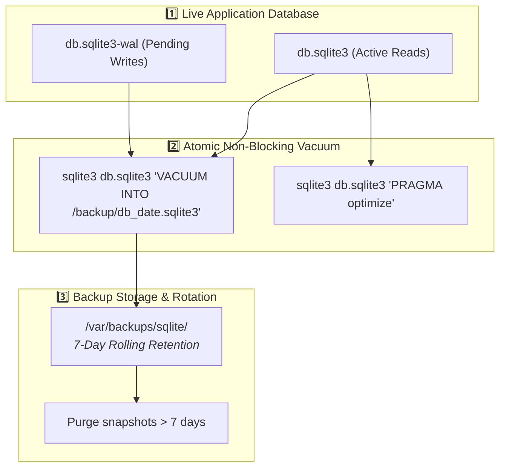

# 🗄️ Automated SQLite Maintenance & Non-Blocking Online Backups

> **System Design Focus**: Zero-Downtime Atomic Snapshots and WAL Checkpointing for Embedded Database Applications (Uptime Kuma, Beszel, Vaultwarden).

---

## 💡 The Core Analogy: Photocopying a Book While Someone is Reading

> Traditional file backups (`cp db.sqlite3 backup.db`) while a database is actively writing in Write-Ahead Log (WAL) mode will produce a corrupted, half-written database snapshot.
>
> **`VACUUM INTO` is an atomic camera snapshot**: SQLite pauses writes for a fraction of a millisecond, flushes all uncommitted WAL pages into a pristine, defragmented single-file backup copy, and resumes application execution with **zero downtime or lock contention**.

---

## 🏗️ SQLite Backup Lifecycle



---

## 🧠 The 3-Layer Cognitive Model (WHAT → HOW → WHY)

### 1. WHAT: The Architecture
A cron-driven maintenance script that targets critical homelab SQLite databases (Uptime Kuma, Beszel Hub, Vaultwarden, AdGuard Home), runs atomic snapshots, optimizes internal B-tree query plans, and manages local rolling retention.

---

### 2. HOW: The Safe Backup Mechanism

```bash
# 1. Atomic live backup into a clean target file
sqlite3 /opt/uptime-kuma/data/kuma.db "VACUUM INTO '/var/backups/sqlite/kuma_backup_$(date +%Y%m%d).sqlite3';"

# 2. Query planner index optimization
sqlite3 /opt/uptime-kuma/data/kuma.db "PRAGMA optimize;"

# 3. Clean snapshots older than 7 days
find /var/backups/sqlite/ -name "kuma_backup_*.sqlite3" -mtime +7 -delete
```

---

### 3. WHY: Why Not Just Copy the File (`cp`)?

1. **WAL Fragmentation**: In SQLite WAL mode, recent changes exist in `-wal` and `-shm` files. A simple `cp` will miss uncommitted transactions or copy a dirty page state.
2. **De-fragmentation**: `VACUUM INTO` rebuilds the database file from scratch, reclaiming unused pages freed by deleted rows and packing B-tree leaf nodes for faster read performance.
