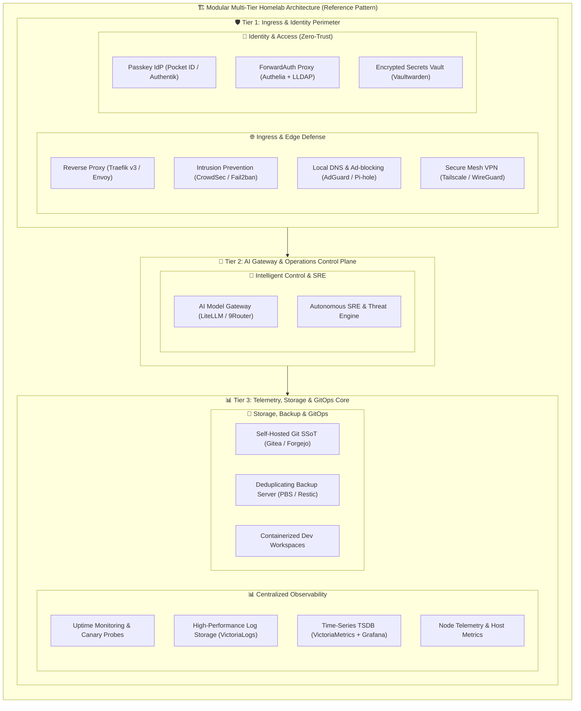
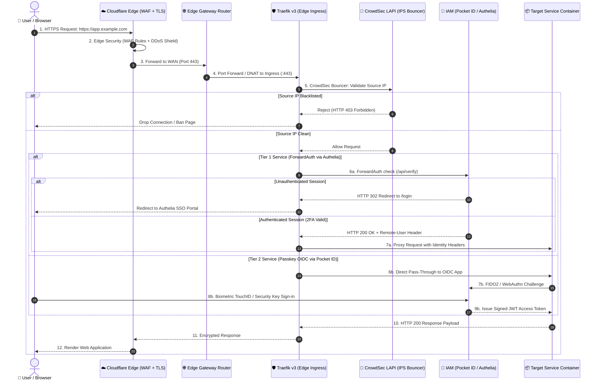
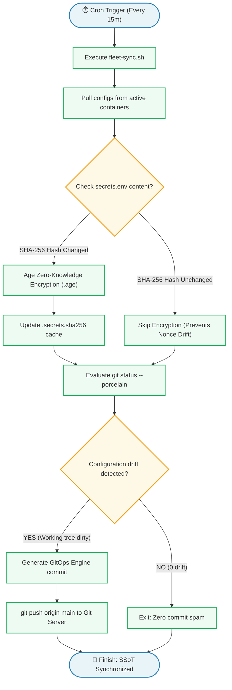
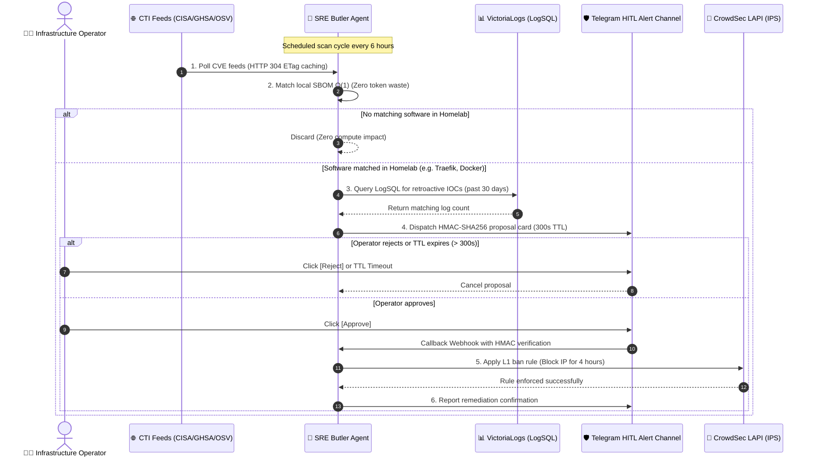

<div align="center">

# 🏗️ AI-Assisted Infrastructure Operations Platform

**Production-Inspired Reference Architecture & SRE Automation for Bare-Metal Homelabs**

[](#)
[](#)
[](#)
[](#)
[](#)
[](#)

**English** · [Issues](https://github.com/tamld/IaC/issues)

</div>

---

## 📌 Overview

A modular, production-inspired collection of infrastructure automation blueprints, Podman LXC orchestration, and bounded self-healing patterns for **bare-metal homelab operations**.

Built on real-world operational SRE experience, this platform enforces three architectural invariants:
- **Isolation**: Unprivileged container namespaces with zero-root execution and dropped Linux capabilities.
- **Defense in Depth**: Multi-layer perimeter defense (Edge WAF $\rightarrow$ Traefik v3 $\rightarrow$ CrowdSec IPS $\rightarrow$ Dual-Tier Passkey/ForwardAuth IAM).
- **Bounded Automation**: Safe operational loops where AI and systemd circuit breakers auto-remediate within strict thresholds, escalating to human operators via signed Telegram cards upon boundary breaches.

---

## 1. 🏛️ Homelab Infrastructure Topology (3-Tier Balanced Architecture)

A modular, resource-optimized 3-tier reference architecture designed for bare-metal Mini PCs running Proxmox VE with rootless Podman on LXC containers.



---

## 2. 🌐 User Traffic Journey & Dual-Tier Ingress Flow

End-to-end request lifecycle from Internet client through Cloudflare WAF, edge router, Traefik edge ingress, CrowdSec IPS, and ADR-028 Dual-Tier IAM to destination containers.



---

## 3. ⚙️ GitOps Zero-Spam State Reconciliation Workflow

Automated drift reconciliation cycle synchronizing live hypervisor state and containers into Git every 15 minutes with content-addressable commit suppression.



---

## 4. 🛡️ CTI Adaptive Threat Defense & In-Situ Forensic Workflow

Closed-loop threat intelligence ingestion, local SBOM matching, VictoriaLogs forensic hunting, and Human-in-the-Loop (HITL) remediation.



---

## 📁 Repository Structure

```
IaC/
├── Docker/                      🐳 Production-Ready Compose & Container Stacks
│   ├── dual-tier-iam/           🔑 Passkey FIDO2 (Pocket ID) + ForwardAuth SSO (Authelia)
│   ├── authelia-lldap/          🔐 Zero-Trust ForwardAuth & LLDAP Directory Engine
│   ├── beszel/                  🦭 Ultra-light (<10MB RAM) Server & Container Monitor
│   ├── observability-lightweight/ 📊 VictoriaMetrics + VictoriaLogs + Grafana Suite
│   ├── traefik/                 ⚡ Traefik v3 Gateway + CrowdSec + Defense Chain
│   ├── vaultwarden/             🔑 Bitwarden-compatible Secret Vault (Zero-Root)
│   ├── gitea/                   🔄 Self-hosted Git Platform + Actions Runner
│   ├── adguard-home/            🛡️ Network-wide DNS Ad & Tracker Blocking
│   ├── caddy/                   ⚡ Automatic HTTPS Reverse Proxy Alternative
│   ├── ddns-go/                 🌐 Multi-provider Dynamic DNS Updater
│   ├── wg-easy/                 🔒 WireGuard VPN with Web UI
│   ├── teleport/                🔐 Zero-Trust Infrastructure Access Gateway
│   ├── wazuh/                   🛡️ SIEM + EDR + Host Compliance
│   └── woodpecker/              🔄 Gitea-native CI/CD Pipeline Runner
│
├── Proxmox/                     🖥️ Proxmox VE Automation & Resilience Blueprints
│   ├── sre-butler/              🥭 Autonomous SRE Butler & Adaptive CTI Threat Defense Engine
│   ├── gitops-reconciler/       ⚙️ Fleet GitOps Reconciler & Zero-Spam State Synchronizer
│   ├── circuit-breaker/         ⚡ Bounded Self-Healing & Systemd Circuit Breakers
│   ├── podman-lxc/              🦭 Daemonless Podman Container Provisioning on LXC
│   ├── sqlite-maintenance/      🗄️ Non-blocking Live SQLite Backups & Auto-Vacuum
│   ├── scripts/                 🛠️ Shell utilities for LXC cloning, backup, SSH hardening
│   └── terraform/               📜 Terraform provider modules for Proxmox VE
│
├── VMware/                      💻 VMware ESXi/vSphere templates
└── Virtualbox/                  📦 VirtualBox local dev environments & automation
```

---

---

## 📜 Architectural Evolution & Lifecycle Matrix

> *"Systems mature as constraints, security insights, and scale evolve."*

| Stack / Technology | Lifecycle Status | Architectural Evolution & Hardening Rationale | Successor / Recommended Choice |
|:---|:---:|:---|:---|
| **[Autonomous SRE Butler](Proxmox/sre-butler/)** | 🟢 `[ACTIVE PROD]` | **Replaces manual triage**: In-situ 60s health loop, Telegram HMAC cards, VictoriaLogs LogSQL CTI hunt. | **Current Production Standard** |
| **[Dual-Tier Identity IAM](Docker/dual-tier-iam/)** | 🟢 `[ACTIVE PROD]` | **ADR-028 Dual-Tier**: WebAuthn Passkeys for Admin/OIDC (Pocket ID) + ForwardAuth for Web Apps (Authelia). | **Current Production Standard** |
| **[GitOps Reconciler](Proxmox/gitops-reconciler/)** | 🟢 `[ACTIVE PROD]` | **Zero-Spam FSM Engine**: Reconciles drift every 15m with Age Zero-Knowledge encryption & SHA-256 caching. | **Current Production Standard** |
| **[Observability Suite](Docker/observability-lightweight/)** | 🟢 `[ACTIVE PROD]` | **Replaced heavy Prometheus+Loki**: Saves 85% RAM (~180MB footprint) on Mini PCs using VictoriaMetrics + VictoriaLogs. | **Current Production Standard** |
| **[Beszel Fleet Monitor](Docker/beszel/)** | 🟢 `[ACTIVE PROD]` | **Replaced cAdvisor+NodeExporter**: <10MB RAM per node, zero-config SSH ed25519 authentication. | **Current Production Standard** |
| **[Authelia + LLDAP](Docker/authelia-lldap/)** | 🟢 `[ACTIVE PROD]` | **Replaced per-app auth & heavy Keycloak**: Zero-Trust ForwardAuth with delegated `admins` group permissions. | **Current Production Standard** |
| **[Traefik v3 Gateway](Docker/traefik/)** | 🟢 `[ACTIVE PROD]` | **Replaced static Caddy configs**: Hot-reloading YAML routers + CrowdSec IPS + Circuit Breaker middlewares. | **Current Production Standard** |
| **[Podman on LXC](Proxmox/podman-lxc/)** | 🟢 `[ACTIVE PROD]` | **Replaced heavy Docker VMs & Privileged LXCs**: Daemonless containerization managed directly by Systemd. | **Current Production Standard** |
| **[Systemd Circuit Breaker](Proxmox/circuit-breaker/)** | 🟢 `[ACTIVE PROD]` | **Replaced infinite `Restart=always`**: Trips after 5 crashes in 10min, halts IO thrashing, fires Telegram alert. | **Current Production Standard** |
| **[Vaultwarden](Docker/vaultwarden/)** | 🟢 `[ACTIVE PROD]` | **Hardened to Zero-Root**: `user: 1000:1000`, `cap_drop: [ALL]`, automated atomic `VACUUM INTO` live backups. | **Current Production Standard** |
| **[Gitea Git Platform](Docker/gitea/)** | 🟢 `[ACTIVE PROD]` | **Migrated to Rootless Architecture**: `gitea-rootless` on custom SSH `:2222` port. | **Current Production Standard** |
| **[Prometheus Stack](Docker/monitor/)** | 📦 `[HISTORICAL]` | Kept for large enterprise setups requiring multi-tenant Alertmanager routing or Thanos clustering. | [`observability-lightweight/`](Docker/observability-lightweight/) |
| **[Caddy Reverse Proxy](Docker/caddy/)** | 📦 `[HISTORICAL]` | Kept for quick single-VPS or local development staging requiring zero-config Auto-TLS. | [`traefik/`](Docker/traefik/) |
| **[Teleport Gateway](Docker/teleport/)** | 📦 `[HISTORICAL]` | Kept for regulated multi-engineer teams requiring SOC2 live terminal audit session recording. | [`authelia-lldap/`](Docker/authelia-lldap/) + Tailscale |
| **[VMware & VirtualBox](VMware/)** | 🟡 `[STANDALONE]` | Vagrant & Ansible playbooks for local developer workstations (Win11/Ubuntu testbeds). | **Standalone Dev Tooling** |

---

## 🚀 Featured Production Stacks

| Stack | Category | Main Highlights | Documentation |
|:---|:---|:---|:---:|
| **[Observability Suite](Docker/observability-lightweight/)** | 📊 Telemetry | 85% less RAM than Prometheus/Loki; unified LogsQL & PromQL | [Read Guide](Docker/observability-lightweight/) |
| **[Beszel Fleet Monitor](Docker/beszel/)** | 🦭 Hardware Metrics | <10MB RAM agent; native CPU/RAM/Disk and Docker charts | [Read Guide](Docker/beszel/) |
| **[Authelia + LLDAP](Docker/authelia-lldap/)** | 🔐 Zero-Trust IAM | Single Sign-On (SSO); Traefik ForwardAuth; `admins` delegation | [Read Guide](Docker/authelia-lldap/) |
| **[Podman on LXC](Proxmox/podman-lxc/)** | 🦭 Container Runtime | Daemonless; native systemd unit control; zero Docker VM overhead | [Read Guide](Proxmox/podman-lxc/) |
| **[Systemd Circuit Breaker](Proxmox/circuit-breaker/)** | ⚡ Self-Healing | Bounded auto-restart; stops crash loops; instant Telegram triage | [Read Guide](Proxmox/circuit-breaker/) |
| **[Traefik v3 Defense](Docker/traefik/)** | 🛡️ Edge Router | Multi-layer chain: CrowdSec IPS + RateLimit + Circuit Breaker | [Read Guide](Docker/traefik/) |
| **[SQLite Auto-Vacuum](Proxmox/sqlite-maintenance/)** | 🗄️ Database Backup | Atomic `VACUUM INTO` live snapshots without container stoppage | [Read Guide](Proxmox/sqlite-maintenance/) |

---

## 🔒 Zero-Leakage & Security Governance Standard

This repository strictly enforces the **Zero-Leakage Data Loss Prevention (DLP)** standard:
- **No Hardcoded Secrets**: All credentials use `.env.example` templates with generic placeholders.
- **Sanitized Network Topology**: All domains use `example.com` / `homelab.internal`; all subnets use standard RFC 1918 addresses (`10.0.0.0/24`, `192.168.1.0/24`).
- **No Binary DB Dumps**: No raw `.sqlite3`, `.db`, or private keys (`.pem`, `.key`) are committed to Git.

---

## 🤝 Contributing

Contributions and improvements are welcome! Please ensure:
1. Every new service stack has a dedicated `README.md` with an architecture flowchart.
2. Configuration files use `.env.example` with zero sensitive credentials.
3. Commit messages follow Conventional Commits: `feat(podman): add ...`

---

<div align="center">

Made with ☕ by [tamld](https://github.com/tamld) &nbsp;|&nbsp; ⭐ Star this repo if it helped your homelab journey!

</div>
